# Wrapt

Die selbst gehostete Remote-Development-Workbench für den privaten Arbeitsplatz im Browser.
Wrapt verbindet Projekte, Terminals, Editoren, Coding-Agenten, Previews, Dateien,
Automatisierungen und Systemdiagnose in einer Oberfläche.

**Aktuelle Vollversion: 1.0.1 · MIT · Node.js 22+ · pnpm 10**

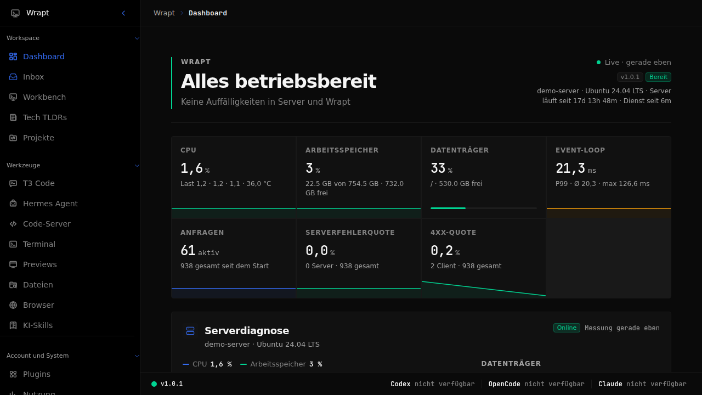

Wrapt läuft standardmäßig auf `127.0.0.1:3010`. Für den Remote-Zugriff ist Tailscale
vorgesehen; öffentliche Freigaben per Funnel gehören bewusst nicht zum Betriebsmodell.

## Was Wrapt bietet

- Einen freien Orbit-Workspace für Projekte, Terminals, Agenten, Previews und Notizen.
- Browserbasierte Werkzeuge für T3 Code, code-server, Codex, OpenCode und Claude Code.
- Persistente PTY-Terminals mit tmux-Supervisor, Wiederaufnahme und Projektbindung.
- Direkte Development-Previews, einen serverseitigen Chromium-Browser und einen Dateimanager.
- Hermes Agent mit offizieller Weboberfläche, Chat, Cron, Skills und Verwaltung.
- Tech TLDRs, Inbox, Nutzungsanalyse, Accountwechsel und lokale Systemdiagnose.
- Ein versioniertes Extension-System und persönliche, deklarative Plugins mit Least Privilege.

## Installation

### Voraussetzungen

- Linux mit systemd für den dauerhaften Betrieb. Die Entwicklung funktioniert auch ohne systemd.
- Node.js `>= 22` und pnpm `10`.
- tmux für persistente Terminal-Sitzungen.
- Optional: Tailscale, Chromium/Chrome, code-server sowie die gewünschten KI-CLIs.

### 1. Repository vorbereiten

```bash
git clone https://github.com/017pixel/Wrapt.git
cd Wrapt
cp config/wrapt.example.json config/wrapt.local.json
cp .env.example .env
```

Passe anschließend `config/wrapt.local.json` an. Mindestens `system`, `paths` und die
erlaubten Tailscale-Identitäten müssen zur Zielumgebung passen. Die `.env` enthält nur
Secrets und neutrale Runtime-Werte; `HOST=127.0.0.1` bleibt in Produktion unverändert.

Alle Beispielwerte verwenden neutrale Konten wie `user@example.com` und `your-user`.

### 2. Abhängigkeiten installieren und bauen

```bash
bash scripts/install-deps.sh
```

Das idempotente Skript prüft Node und pnpm, installiert die Workspace-Abhängigkeiten und
baut Extension Contracts, Contracts, Backend und Frontend in der richtigen Reihenfolge.

### 3. Startmodus wählen

Entwicklung mit Hot Reload:

```bash
pnpm dev
```

Produktionsserver im Vordergrund:

```bash
pnpm start
```

Dauerhafter Betrieb als systemd-User-Dienst:

```bash
bash deploy/systemd/install.sh
```

Der systemd-Installer baut und prüft Wrapt, installiert beziehungsweise aktualisiert die
User-Units und startet die betroffenen Dienste. Führe ihn deshalb nur aus, wenn ein
Dienstwechsel in diesem Moment gewollt ist.

### 4. Installation prüfen

```bash
curl -f http://127.0.0.1:3010/api/v1/health
systemctl --user status wrapt.service  # nur bei systemd-Installation
```

Öffne lokal `http://127.0.0.1:3010/wrapt/`. Der optionale private Tailscale-Zugang wird
anschließend mit `bash deploy/proxy/configure-tailscale-serve.sh` eingerichtet.

Die vollständigen Wege, Voraussetzungen und Prüfungen stehen in der
[Installationsanleitung](docs/installation.md). Für eine agentengestützte Einrichtung gibt es
die genaue [Agent-Setup-Anleitung](docs/agent-setup.md).

## Plugin- und Extension-System

Wrapt unterscheidet drei Ebenen:

| Ebene | Zweck | Speicherort |
| --- | --- | --- |
| Persönlicher Plugin-Draft | Lokales Werkzeug für eine Wrapt-Instanz | `<dataDir>/plugin-drafts` |
| Installiertes Plugin | Validiertes Laufzeitpaket | `<dataDir>/extension-catalog` |
| Versionierte Extension | Teilbares oder First-Party-Paket | `extensions/` |

Persönliche Drafts entstehen in **Plugins → Neues Plugin erstellen** wahlweise mit KI,
visuell oder als Code-Paket. Versionierte Extensions werden mit den öffentlichen Contracts
erstellt:

```bash
pnpm extension:create beispiel.mein-plugin
pnpm extension:validate extensions/beispiel.mein-plugin
```

### `$plugin-creator` für Codex installieren

Dieses Repository enthält einen vollständigen Codex-Marktplatz unter `.agents/plugins`.
Nach dem Klonen lässt sich der Wrapt-spezifische Creator so installieren:

```bash
codex plugin marketplace add "$PWD/.agents/plugins"
codex plugin add wrapt-extension-creator@wrapt
```

Danach kann Codex den enthaltenen Skill direkt verwenden:

```text
$plugin-creator Erstelle ein persönliches Wrapt-Plugin für eine kompakte Projektstatus-Seite.
```

Der Skill trennt persönliche Drafts von versionierten Extensions, arbeitet bei Drafts über
die Authoring-API, verlangt explizite Permissions und aktiviert nur erfolgreich validierte
Pakete. Aufbau, Installation und Veröffentlichung sind in
[Plugins und Extensions](docs/extensions/plugin-marketplace.md) sowie im
[Authoring-Guide](docs/extensions/authoring.md) beschrieben.

## Oberfläche

Die Wrapt-Aufnahmen stammen aus einer isolierten Dokumentationsinstanz; eingebettete
Werkzeuge wurden zusätzlich einzeln auf persönliche Inhalte geprüft. Es sind nur
Beispielkonten und neutrale Projektdaten sichtbar; T3 Code ist im Dark Mode dargestellt.

| Orbit-Workbench | Tech TLDRs |
| :--: | :--: |
| 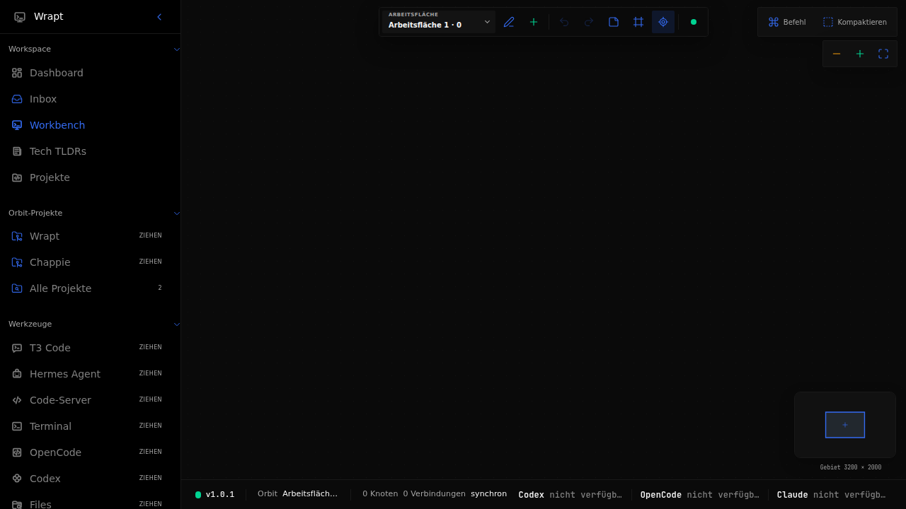 | 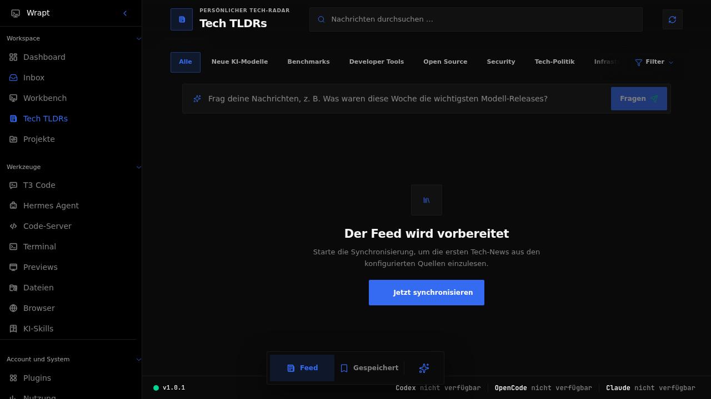 |

| T3 Code im Dark Mode | code-server |
| :--: | :--: |
| 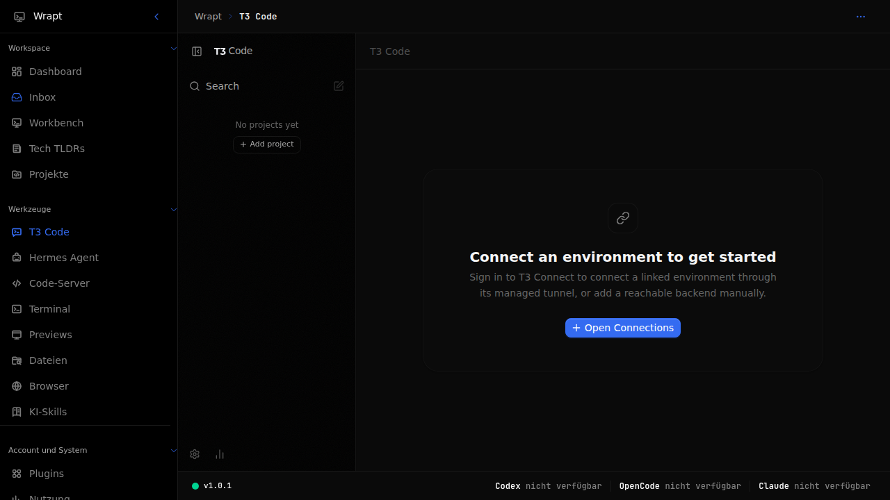 | 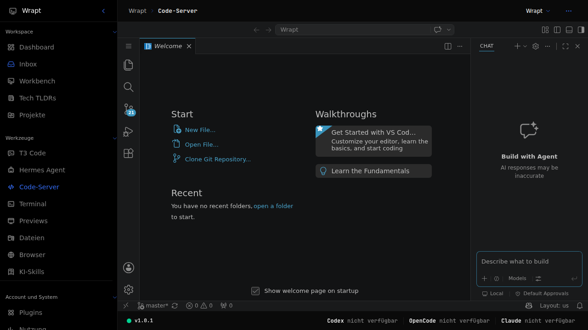 |

| Plugin-Verwaltung | Plugin Creator |
| :--: | :--: |
| 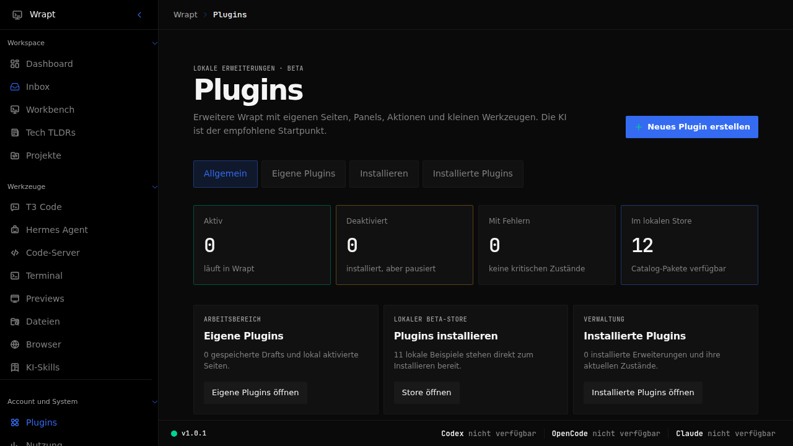 | 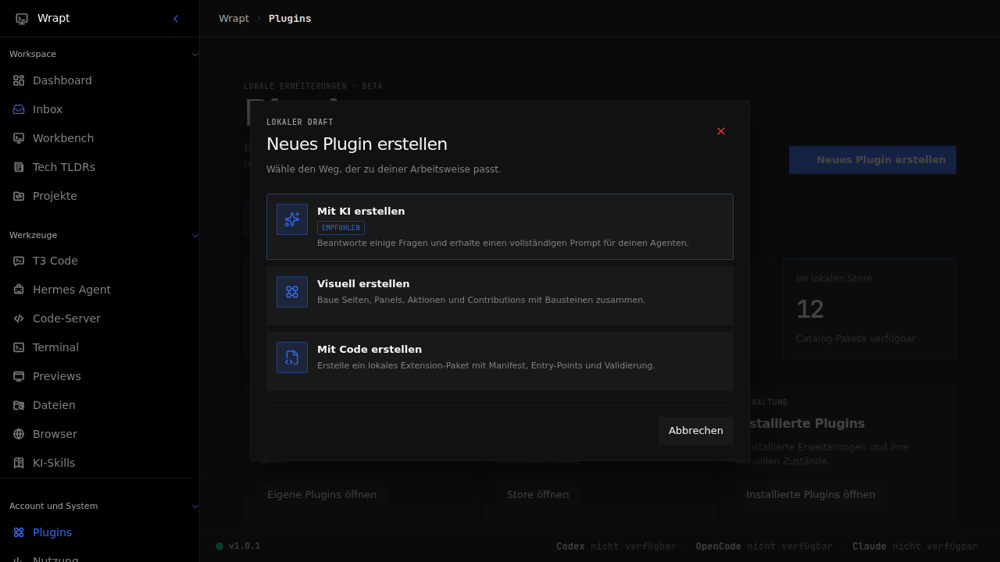 |

| Dateimanager | Terminal |
| :--: | :--: |
| 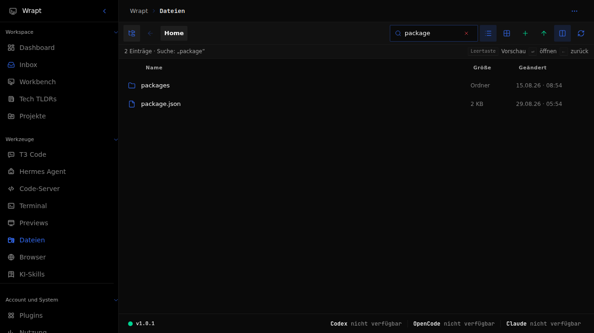 | 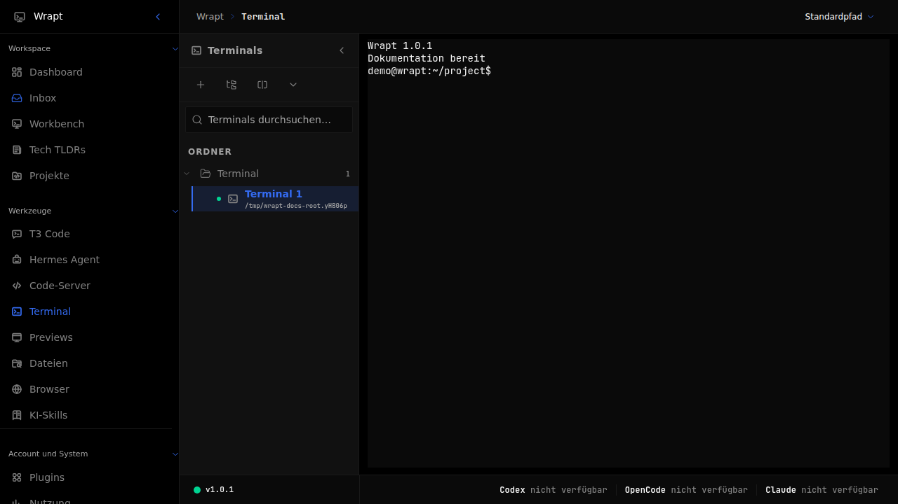 |

| Nutzung | Einstellungen |
| :--: | :--: |
| 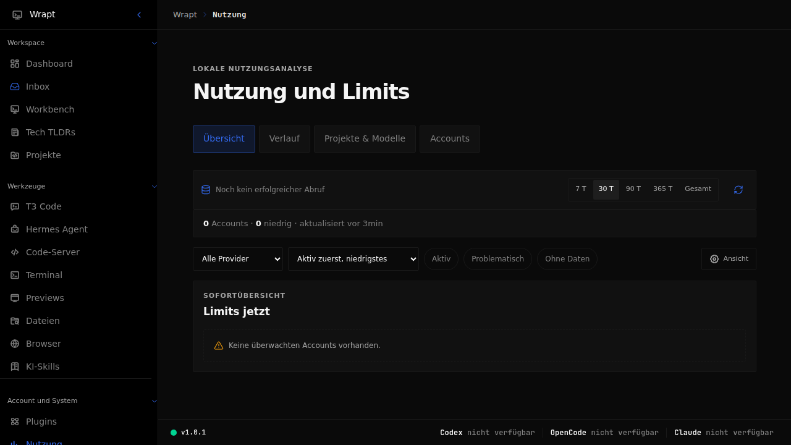 | 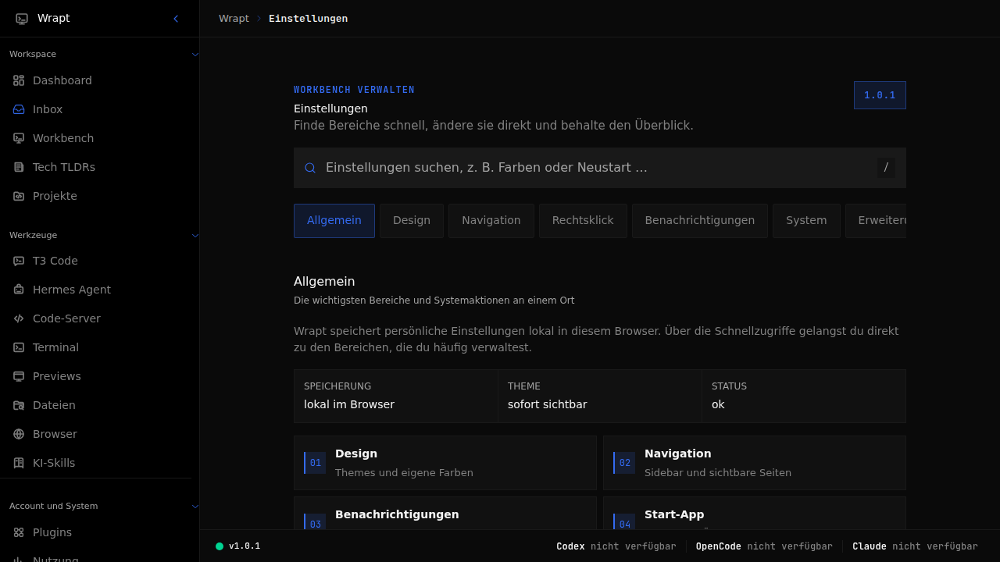 |

## Entwicklung

```bash
pnpm typecheck
pnpm lint
pnpm test
pnpm build
pnpm architecture:file-lines
pnpm test:e2e
```

Wichtige Regeln:

- API-Verträge zuerst in `packages/contracts` definieren.
- Extension-Verträge liegen in `packages/extension-contracts` und werden zuerst gebaut.
- Konfigurierbare Werte gehören in `config/wrapt.local.json` oder `.env`.
- Handgeschriebene Projektdateien bleiben unter 400 physischen Zeilen.
- Öffentliche oder persistierte Schnittstellen werden nicht still inkompatibel geändert.

## Sicherheit und Daten

- Eigene Dienste binden standardmäßig nur an Loopback.
- Geschützte Routen verlangen eine erlaubte Tailscale-Identität; Mutationen zusätzlich Same-Origin.
- Accounts, Tokens und Browserprofile bleiben auf dem Server und werden nicht im Browserzustand gespeichert.
- Orbit, Plugins, Nutzung und weitere lokale Daten liegen außerhalb des Repositorys in SQLite
  beziehungsweise im konfigurierten `dataDir`.
- Preview-, Terminal-, Datei- und Extension-Zugriffe sind auf serverseitig geprüfte Pfade und
  deklarierte Berechtigungen begrenzt.

Weitere Details: [Architektur](docs/architecture.md),
[Konfiguration](docs/configuration.md),
[Sicherheitsausnahmen](docs/security-exceptions.md) und
[Fehlerbehebung](docs/troubleshooting.md).

## Dokumentation

Der vollständige Einstieg nach Zielgruppe steht im [Dokumentationsindex](docs/README.md).

- [Installation](docs/installation.md)
- [Konfiguration](docs/configuration.md)
- [Agent-Setup](docs/agent-setup.md)
- [Plugin-Marktplatz](docs/extensions/plugin-marketplace.md)
- [Extension Authoring](docs/extensions/authoring.md)
- [Architektur](docs/architecture.md)
- [Terminal](docs/terminal.md)
- [Previews für Agenten](docs/previews-for-agents.md)
- [Fehlerbehebung](docs/troubleshooting.md)

## Danksagungen

Wrapt integriert und orchestriert unter anderem
[T3 Code](https://github.com/pingdotgg/t3code),
[code-server](https://github.com/coder/code-server),
[node-pty](https://github.com/microsoft/node-pty),
[xterm.js](https://github.com/xtermjs/xterm.js),
[Tailscale](https://github.com/tailscale/tailscale) und
[Hermes Agent](https://github.com/NousResearch/hermes-agent).

## Lizenz

[MIT](LICENSE) © 2026 017pixel
