# Wrapt

Die selbst gehostete Remote-Development-Workbench für den privaten Arbeitsplatz im Browser.
Wrapt verbindet Projekte, Terminals, Editoren, Coding-Agenten, Previews, Dateien,
Automatisierungen und Systemdiagnose in einer Oberfläche.

**Aktuelle Version 2.2.0 · MIT · Node.js 22+ · pnpm 10 · [Changelog](CHANGELOG.md)**

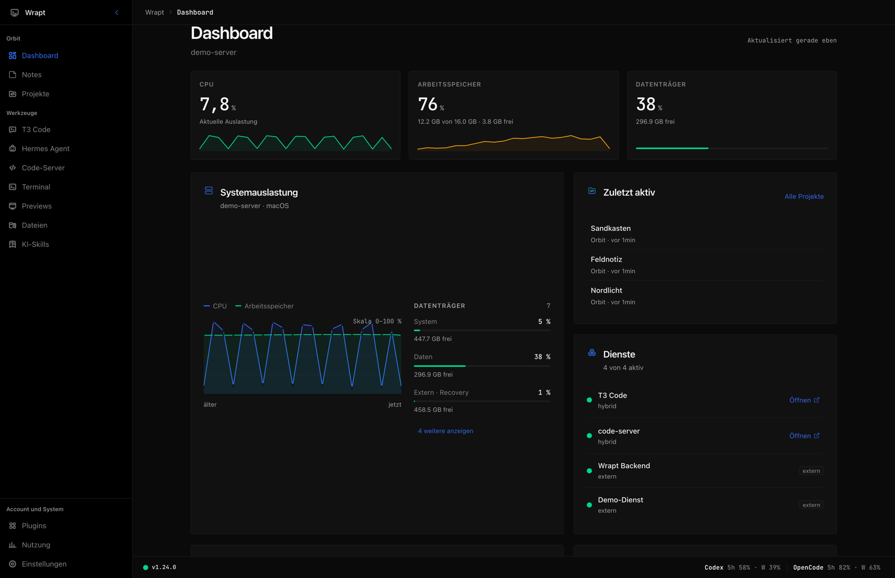

Wrapt läuft standardmäßig auf `127.0.0.1:3010`. Für den Remote-Zugriff ist Tailscale
vorgesehen; öffentliche Freigaben per Funnel gehören bewusst nicht zum Betriebsmodell.

## Was Wrapt bietet

- Orbit-Boards für Projekte, Terminals, Agenten, Previews und Notizen.
- Browserbasierte Werkzeuge für T3 Code, code-server, Codex, OpenCode und Claude Code.
- Persistente PTY-Terminals mit tmux-Supervisor, Wiederaufnahme und Projektbindung.
- Direkte Development-Previews und einen Dateimanager.
- [Notizen](docs/notes.md) mit Unterseiten, Favoriten, eigenen Ordnern und sortierbarer Seitenleiste.
- Hermes Agent mit offizieller Weboberfläche, Chat, Cron, Skills und Verwaltung.
- Benachrichtigungen, Nutzungsanalyse, Accountwechsel und lokale Systemdiagnose.
- Ein versioniertes Extension-System und persönliche, deklarative Plugins mit Least Privilege.

## Installation

Für den Server benötigt Wrapt Node.js 22+ und pnpm 10. Linux mit systemd ist der
empfohlene Weg für den dauerhaften Serverbetrieb; lokal lässt sich Wrapt auf macOS
im Vordergrund starten. Der Terminalkern verwendet auf Linux/macOS tmux und unter
nativem Windows ConPTY. Die Unterschiede bei Neustart und Persistenz stehen in der
[Terminal-Anleitung](docs/terminal.md). Ein Coding-Agent auf
dem Zielserver richtet den Linux-Dienst ein; Skripte und Handarbeit führen zum selben Ergebnis.
Die vollständigen Wege und Prüfungen stehen in der
[Installationsanleitung](docs/installation.md).

### Mit einem Coding-Agenten (empfohlen)

Diesen Text auf dem Zielserver in Codex, Claude Code oder OpenCode einfügen. Der
Agent klont Wrapt, fragt die nötigen Werte ab, richtet den Dienst ein und prüft
das Ergebnis. Den Dienstwechsel bestätigt er vorher ausdrücklich.

```text
Richte Wrapt auf diesem Server ein. Repository: https://github.com/017pixel/Wrapt.git

1. Prüfe die Voraussetzungen: Linux mit systemd, Node.js >= 22, pnpm 10, tmux,
   git und curl. jq ist nur für Tailscale Serve nötig. Für dauerhaften Betrieb
   ohne offene SSH-Sitzung kann `loginctl enable-linger "$(id -un)"` nötig sein.
   Installiere fehlende Systempakete nur nach meiner Bestätigung.
2. Klone das Repository nach ~/Wrapt und lies AGENTS.md, README.md,
   docs/installation.md und docs/agent-setup.md vollständig.
3. Frage mich, ob der Browserzugriff über Tailscale oder ausschließlich lokal auf
   diesem Server erfolgen soll. Für Tailscale frage nach Hostname, IP, HTTPS-Port
   und erlaubten Login-E-Mails. Für lokalen Zugriff setze `security.localLoopbackTrust`
   auf `true` und `security.localUsername` auf den tatsächlichen Systembenutzer.
   Lokales Vertrauen erlaubt keinen Zugriff von anderen Geräten. Wenn ich entfernten
   Zugriff ohne Tailscale möchte, richte keinen öffentlichen Zugang ein und melde
   die fehlende Voraussetzung.
4. Frage nach Dienstbenutzer und Home sowie Projektwurzel, sofern sie sich nicht
   sicher ableiten lassen. Lege `config/wrapt.local.json` und `.env` aus den
   Vorlagen an. Bei ausschließlich lokalem Zugriff lasse `tailscale.allowedUsers`
   leer. Trage den lokalen Benutzernamen bei Bedarf auch in `tailscale.adminUsers`
   ein, damit er Adminrechte erhält.
   Persönliche Pfade gehören nicht in die `.env`. Secrets niemals ausgeben oder committen.
5. Führe bash scripts/install-deps.sh aus.
6. Richte den Dienst mit bash deploy/systemd/install.sh ein. Frage mich vorher,
   ob der Dienstwechsel jetzt stattfinden darf.
7. Prüfe `curl -f http://127.0.0.1:3010/api/v1/health`. Öffne die Oberfläche
   lokal unter `http://127.0.0.1:3010/wrapt/` oder bei gewähltem Tailscale-Zugang
   über den konfigurierten HTTPS-Host. Stelle sicher, dass die Projekte aus
   `paths.projectsRoot` erscheinen.
8. Nur bei gewähltem Tailscale-Zugang: `bash deploy/proxy/configure-tailscale-serve.sh`.
   `bash scripts/install-hermes.sh` nur ausführen, wenn Hermes bereits installiert
   ist und ich die Anbindung möchte.
9. Melde am Ende kurz: was läuft, welche optionalen Dienste aktiv sind, welcher
   Prüfpunkt offen ist. Keine Secrets wiedergeben.
```

### Manuell

```bash
git clone https://github.com/017pixel/Wrapt.git
cd Wrapt
cp config/wrapt.example.json config/wrapt.local.json
cp .env.example .env
bash scripts/install-deps.sh
```

Passe vor dem ersten Start `config/wrapt.local.json` an: `system` und `paths` müssen
zur Zielumgebung passen. `tailscale.allowedUsers` wird für Tailnet-Zugriff verwendet.
Die `.env` enthält nur
Secrets und neutrale Runtime-Werte; `HOST=127.0.0.1` bleibt in Produktion unverändert.
Alle Beispielwerte verwenden neutrale Konten wie `user@example.com` und `your-user`.

Danach einen Startmodus wählen:

```bash
pnpm dev     # Entwicklung: Server und Vite mit Hot Reload, UI unter http://127.0.0.1:5173/wrapt/
pnpm start   # Produktion im Vordergrund nach dem Build, UI unter http://127.0.0.1:3010/wrapt/
bash deploy/systemd/install.sh   # dauerhafter Betrieb als systemd-User-Dienst
```

Der systemd-Installer baut und prüft Wrapt, installiert beziehungsweise aktualisiert die
User-Units inklusive tmux-Terminal-Supervisor und startet die Dienste. Führe ihn deshalb
nur aus, wenn ein Dienstwechsel in diesem Moment gewollt ist.

```bash
curl -f http://127.0.0.1:3010/api/v1/health
systemctl --user status wrapt.service   # nur bei systemd-Installation
```

Ohne Tailscale-Proxy braucht die Entwicklung eine lokale Identität im Vite-Proxy:

```bash
WRAPT_DEV_TAILSCALE_USER=user@example.com pnpm dev
```

Der Wert muss in `tailscale.allowedUsers` stehen und gehört nur in diese Shell — niemals in
die `.env`, denn der Dienst läuft in Produktion mit `NODE_ENV=production` und lehnt die
Variable beim Start ab.

Für den Produktionsstart oder Launcher ohne Tailscale ist lokaler Browserzugriff nur über
`security.localLoopbackTrust` möglich. Diese Einstellung gilt ausschließlich, wenn der
Browser auf demselben Rechner zugreift. Details und Adminrechte stehen in der
[Konfigurationsanleitung](docs/configuration.md#lokaler-zugriff-ohne-tailscale).

Der private Tailscale-Zugang wird anschließend mit
`bash deploy/proxy/configure-tailscale-serve.sh` eingerichtet (das Skript nutzt intern
`sudo` für `tailscale serve`).

T3 Code und OpenCode Web werden beim ersten Backend-Neustart eingerichtet und gestartet
(Einstellungen → „Dienst neu starten" oder `bash scripts/restart-backend.sh`). Eine
agentengestützte Einrichtung beschreibt die [Agent-Setup-Anleitung](docs/agent-setup.md).

## Plugin- und Extension-System

Wrapt unterscheidet drei Ebenen:

| Ebene | Zweck | Speicherort |
| --- | --- | --- |
| Persönlicher Plugin-Draft | Lokales Werkzeug für eine Wrapt-Instanz | `<dataDir>/plugin-drafts` |
| Installiertes Plugin | Validiertes Laufzeitpaket | `<dataDir>/extension-catalog` |
| Versionierte Extension | Teilbares oder First-Party-Paket | `extensions/` |

Persönliche Drafts entstehen in **Plugins → Neues Plugin erstellen** wahlweise mit KI,
visuell oder als Code-Paket. Versionierte Extensions werden mit den öffentlichen Contracts
erstellt:

```bash
pnpm extension:create beispiel.mein-plugin
pnpm extension:validate extensions/beispiel.mein-plugin
```

### `$wrapt-plugins` für Codex installieren

Dieses Repository enthält einen vollständigen Codex-Marktplatz unter `.agents/plugins`.
Nach dem Klonen lässt sich der Wrapt-spezifische Creator so installieren:

```bash
codex plugin marketplace add "$PWD/.agents/plugins"
codex plugin add wrapt-extension-creator@wrapt
```

Danach kann Codex den enthaltenen Skill direkt verwenden:

```text
$wrapt-plugins Erstelle ein persönliches Wrapt-Plugin für eine kompakte Projektstatus-Seite.
```

Der Skill erstellt und verwaltet persönliche Drafts ausschließlich über die Authoring-API,
verlangt explizite Permissions und aktiviert nur erfolgreich validierte Pakete. Persönliche
Plugins erscheinen nur unter „Eigene Plugins“ und niemals unter „Installieren“. Aufbau,
Installation und API sind in
[Plugins und Extensions](docs/extensions/plugin-marketplace.md) sowie im
[Authoring-Guide](docs/extensions/authoring.md) beschrieben.

## Oberfläche

Die Wrapt-Aufnahmen stammen aus einer isolierten Dokumentationsinstanz; eingebettete
Werkzeuge wurden zusätzlich einzeln auf persönliche Inhalte geprüft. Es sind nur
Beispielkonten und neutrale Projektdaten sichtbar; T3 Code ist im Dark Mode dargestellt.
Es sind dieselben Dateien wie auf der Dokumentationsseite unter `docs-webseite/assets/`;
gepflegt werden sie über den Skill „docs/readme Screenshots updaten“.

| Orbit | Dateimanager |
| :--: | :--: |
| 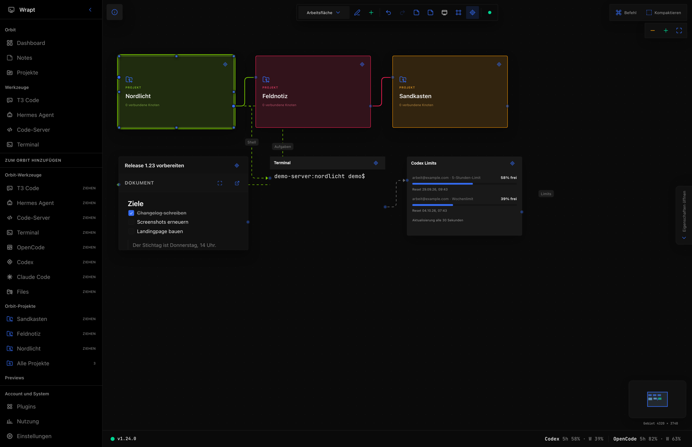 | 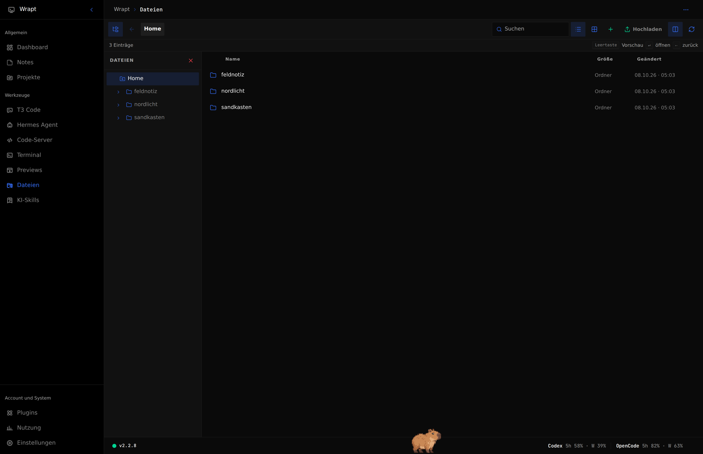 |

| T3 Code im Dark Mode | code-server |
| :--: | :--: |
| 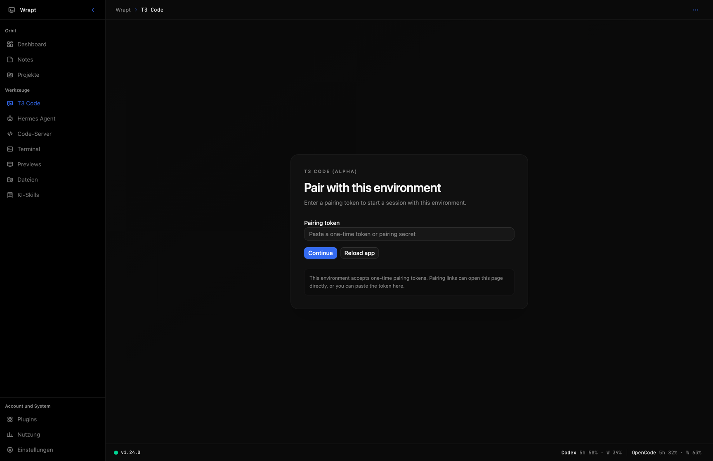 | 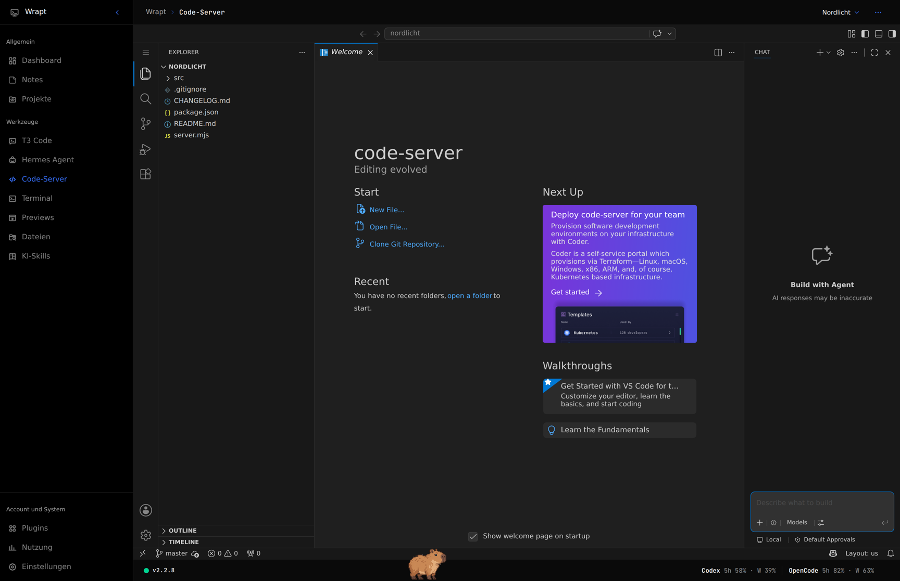 |

| Hermes Agent | Nutzung |
| :--: | :--: |
| 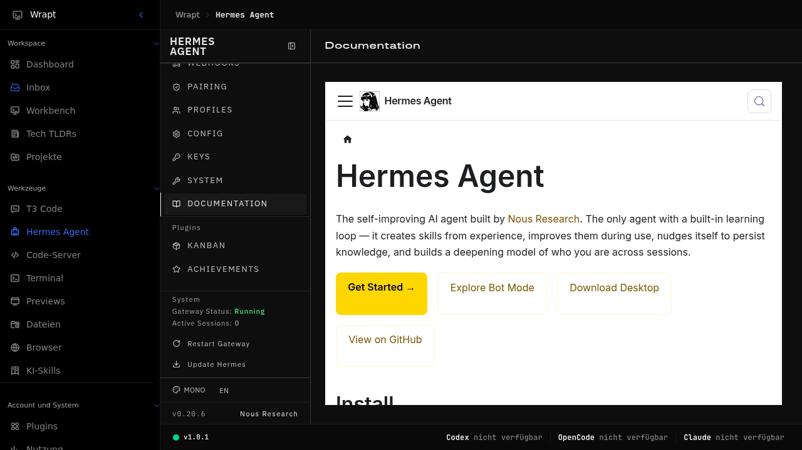 | 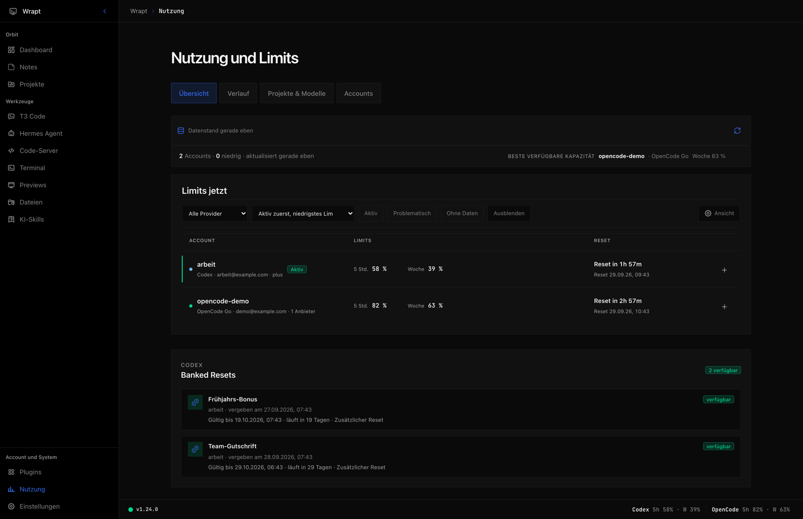 |

| Plugin-Verwaltung | Wrapt-Plugins |
| :--: | :--: |
| 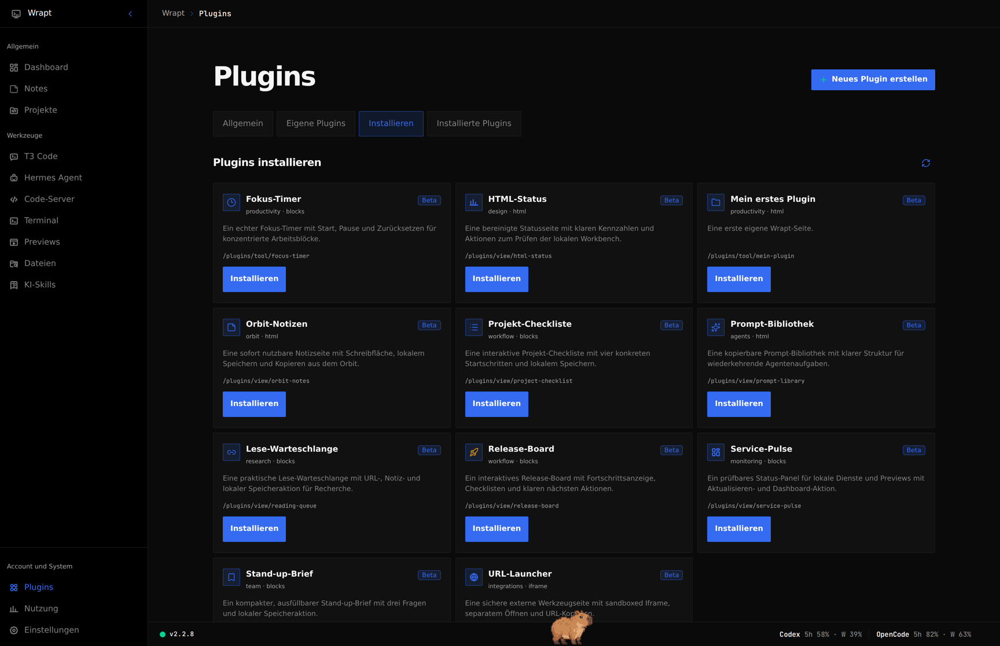 | 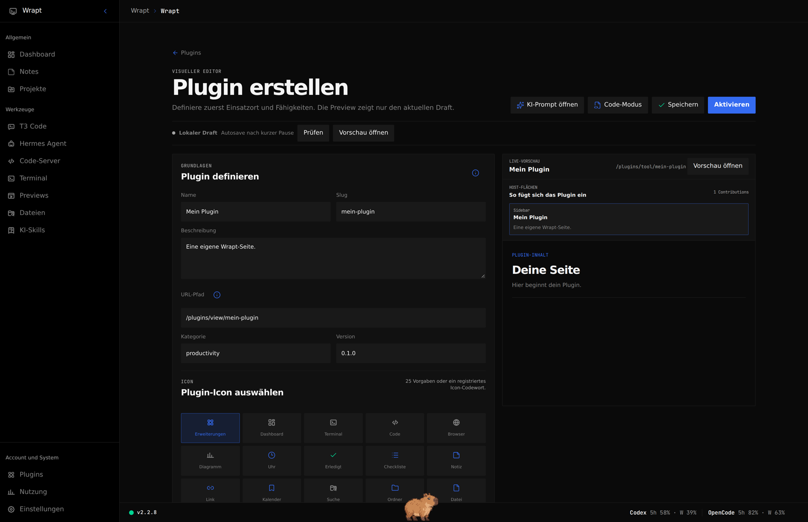 |

| Terminal | Einstellungen |
| :--: | :--: |
| 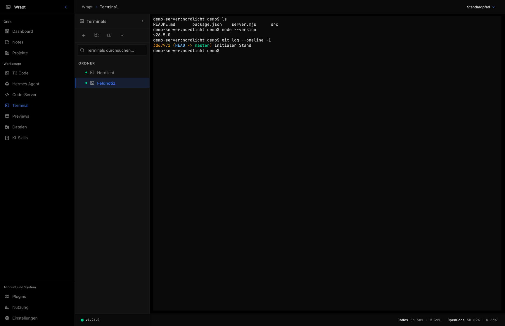 | 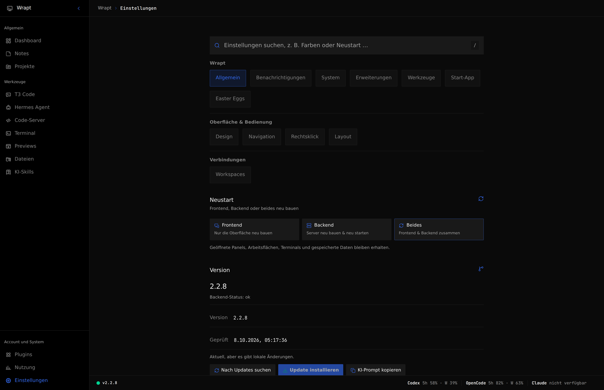 |

## Entwicklung

```bash
pnpm typecheck
pnpm lint
pnpm test
pnpm build
pnpm architecture:file-lines
WRAPT_E2E_PORT=13100 pnpm test:e2e
```

Wähle für `WRAPT_E2E_PORT` einen freien Port und prüfe, dass auch die folgenden 130 Ports frei
sind. Der Lauf baut `apps/server/dist` im aktuellen Checkout neu; führe ihn deshalb vorzugsweise
aus einer separaten Arbeitskopie aus. E2E-Tests gehören auf ihre eigene Instanz und dürfen weder
eine Nutzer-Preview als `WRAPT_E2E_URL` verwenden noch gegen Preview-Ports laufen. Details stehen
in [Hardening und Prüfungen](docs/hardening.md).

Wichtige Regeln:

- API-Verträge zuerst in `packages/contracts` definieren.
- Extension-Verträge liegen in `packages/extension-contracts` und werden zuerst gebaut.
- Konfigurierbare Werte gehören in `config/wrapt.local.json` oder `.env`.
- Handgeschriebene Projektdateien bleiben unter 400 physischen Zeilen.
- Öffentliche oder persistierte Schnittstellen werden nicht still inkompatibel geändert.

## Sicherheit und Daten

- Eigene Dienste binden standardmäßig nur an Loopback.
- Geschützte Routen verlangen eine erlaubte Tailscale-Identität; Mutationen zusätzlich Same-Origin.
- Accounts, Tokens und Browserprofile bleiben auf dem Server und werden nicht im Browserzustand gespeichert.
- Orbit, Plugins, Nutzung und weitere lokale Daten liegen außerhalb des Repositorys in SQLite
  beziehungsweise im konfigurierten `dataDir`.
- Preview-, Terminal-, Datei- und Extension-Zugriffe sind auf serverseitig geprüfte Pfade und
  deklarierte Berechtigungen begrenzt.

Weitere Details: [Architektur](docs/architecture.md),
[Konfiguration](docs/configuration.md),
[Sicherheitsausnahmen](docs/security-exceptions.md) und
[Fehlerbehebung](docs/troubleshooting.md).

## Dokumentation

Der vollständige Einstieg nach Zielgruppe steht im [Dokumentationsindex](docs/README.md).

- [Installation](docs/installation.md)
- [Konfiguration](docs/configuration.md)
- [Agent-Setup](docs/agent-setup.md)
- [Plugin-Marktplatz](docs/extensions/plugin-marketplace.md)
- [Extension Authoring](docs/extensions/authoring.md)
- [Architektur](docs/architecture.md)
- [Terminal](docs/terminal.md)
- [Previews für Agenten](docs/previews-for-agents.md)
- [Fehlerbehebung](docs/troubleshooting.md)
- [Changelog](CHANGELOG.md)

## Danksagungen

Wrapt integriert und orchestriert unter anderem
[T3 Code](https://github.com/pingdotgg/t3code),
[code-server](https://github.com/coder/code-server),
[node-pty](https://github.com/microsoft/node-pty),
[xterm.js](https://github.com/xtermjs/xterm.js),
[Tailscale](https://github.com/tailscale/tailscale) und
[Hermes Agent](https://github.com/NousResearch/hermes-agent).

## Lizenz

[MIT](LICENSE) © 2026 017pixel
